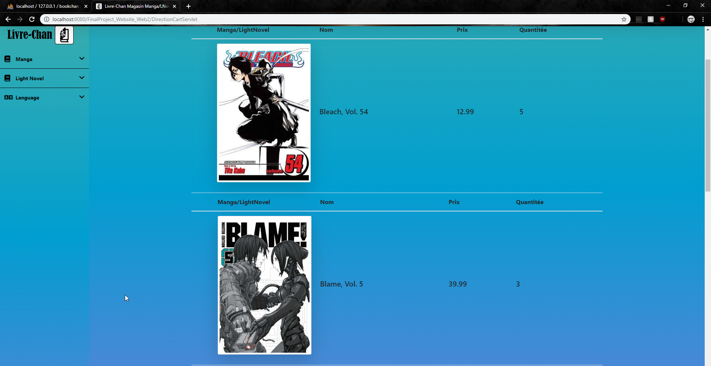
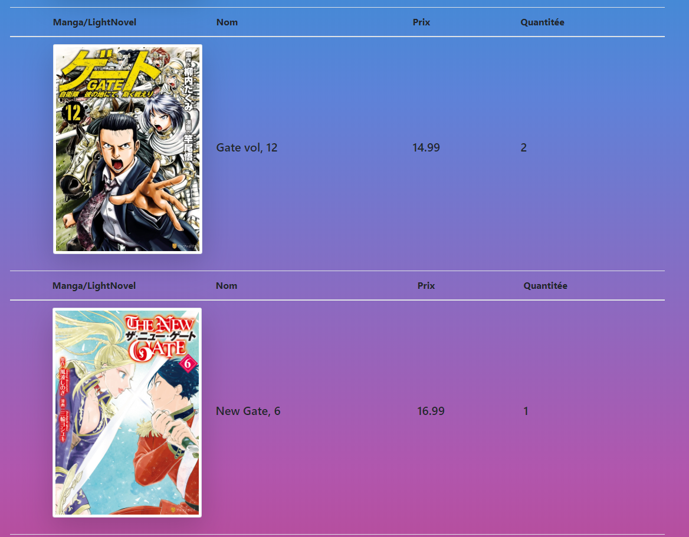
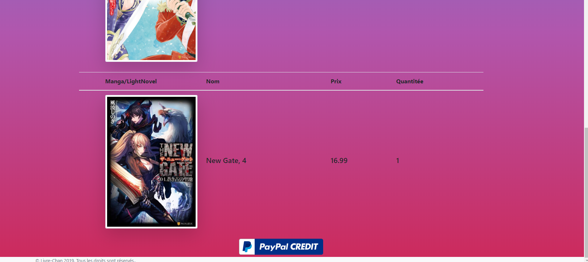
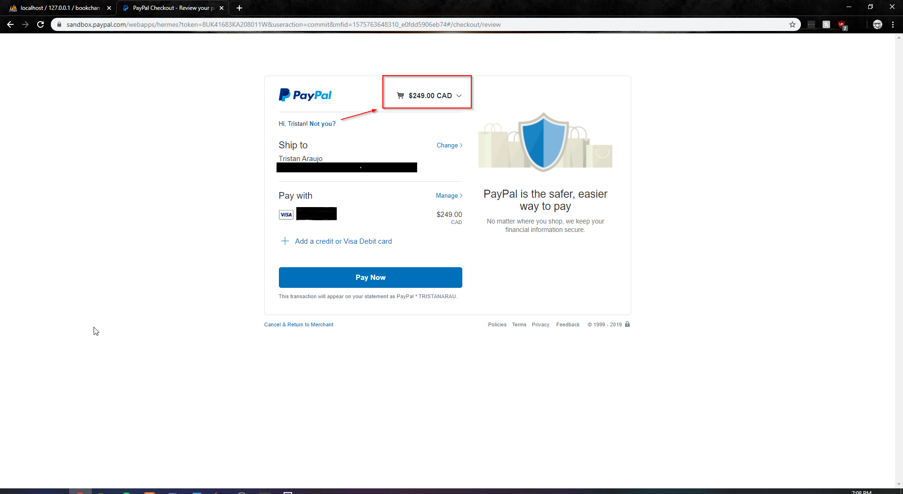
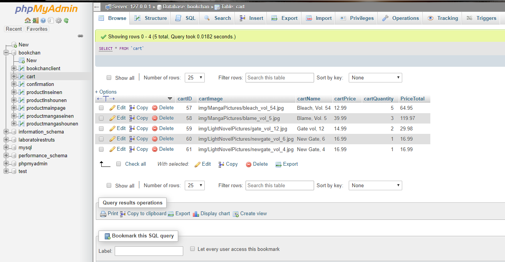
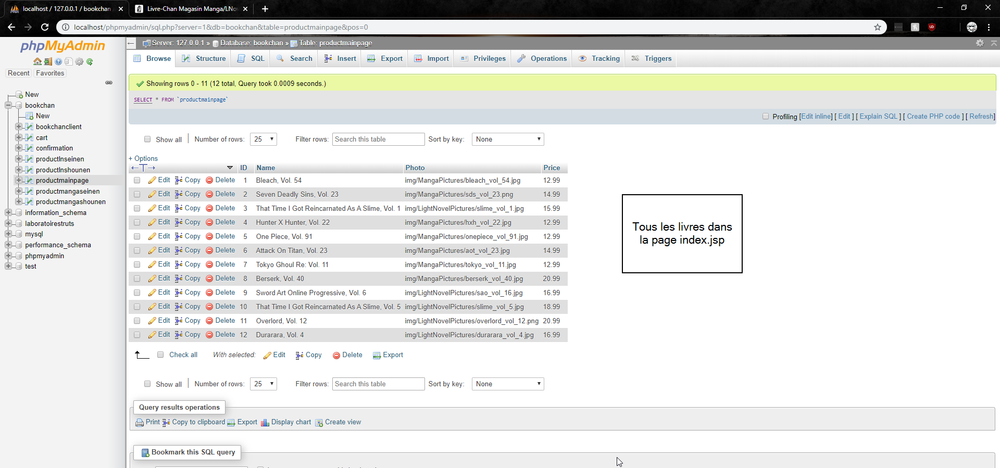
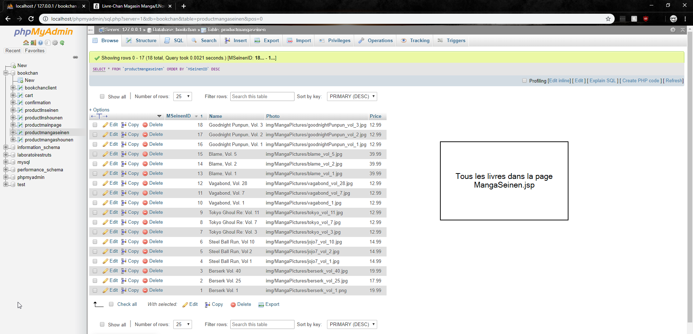
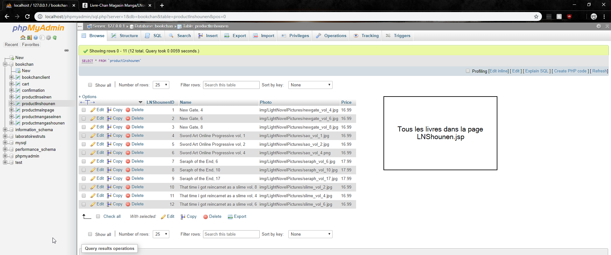
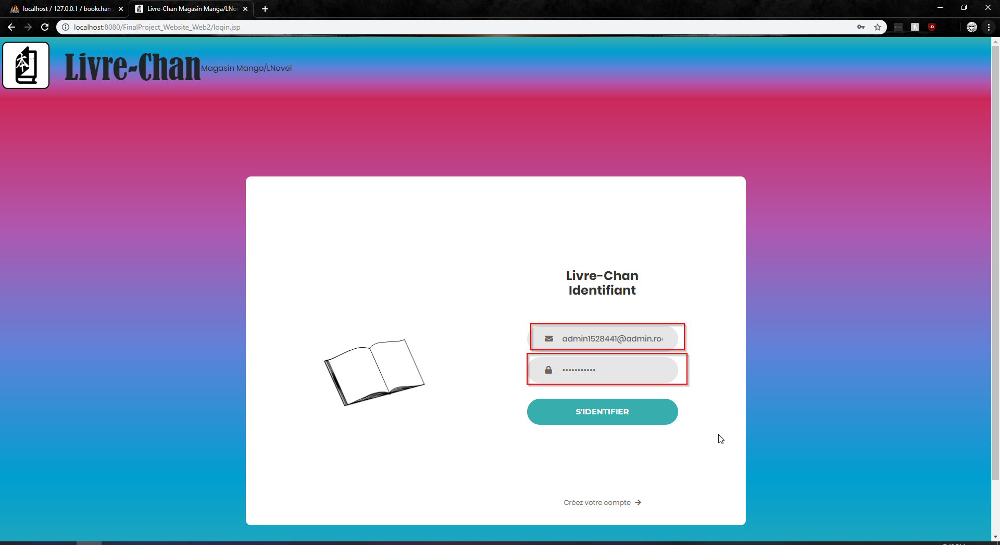
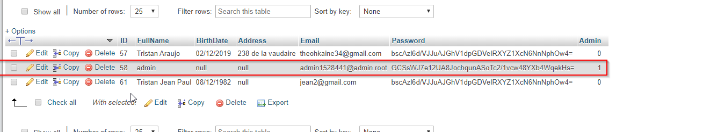

# Project_MangaStore
Final project for the final semester in the class Web Application 2 at la Cité. This project consists of creating a brand new front end design from the ground up by using **Bootsrap, CSS and HTML5** and creating a working E-Commerce Website. This whole project was coding in **Java & Java J2EE** on Eclipse. The database was created with **Java JDBC** and with the help of **MySQL on XAMPP**.
 
## The front end of my website

## The process of adding a book into the cart.

 

 
 
 
 

